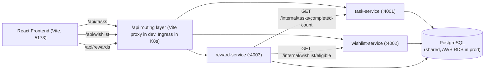
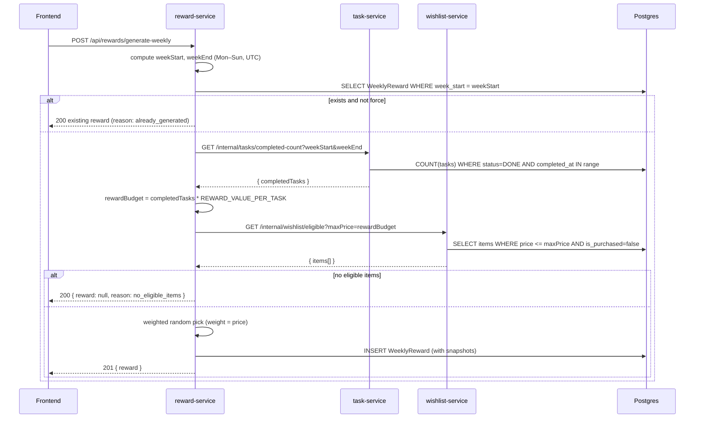

# TaskTreat — Architecture

This document describes the application architecture for **Step 1**: the frontend, three backend microservices, and the shared database. Infrastructure (Terraform, EKS, RDS provisioning, CI/CD, observability) is intentionally out of scope here.

## High-level diagram

## Service responsibilities

| Service           | Port  | Owns table         | Public prefix     | Internal prefix      | Calls                  |
| ----------------- | ----- | ------------------ | ----------------- | -------------------- | ---------------------- |
| `task-service`    | 4001  | `tasks`            | `/api/tasks`      | `/internal/tasks`    | —                      |
| `wishlist-service`| 4002  | `wishlist_items`   | `/api/wishlist`   | `/internal/wishlist` | —                      |
| `reward-service`  | 4003  | `weekly_rewards`   | `/api/rewards`    | —                    | task-service, wishlist-service |
| `frontend`        | 5173  | —                  | —                 | —                    | All 3 via `/api/...`   |

## Database ownership

One shared Postgres database, three logical owners. Each service has its **own Prisma schema file** that declares only the table(s) it owns. Migrations are run independently per service. No service reads or writes another service's table directly — cross-domain reads go through the internal HTTP APIs.

| Table             | Owner               | Notes                                                            |
| ----------------- | ------------------- | ---------------------------------------------------------------- |
| `tasks`           | `task-service`      | Status enum, optional priority, `completed_at` stamp on first DONE |
| `wishlist_items`  | `wishlist-service`  | `is_purchased` flag, `price` Decimal(10,2)                       |
| `weekly_rewards`  | `reward-service`    | Unique `week_start`, snapshots of item name/price                |

## Data flow: generate weekly treat

## Inter-service URLs

| Environment | Task                                | Wishlist                            |
| ----------- | ----------------------------------- | ----------------------------------- |
| Local dev   | `http://localhost:4001`             | `http://localhost:4002`             |
| Kubernetes  | `http://task-service:4001`          | `http://wishlist-service:4002`      |

These are read by `reward-service` from `TASK_SERVICE_URL` and `WISHLIST_SERVICE_URL`.

## Environment variables

### Shared

- `DATABASE_URL` — Postgres connection string. Same value for all 3 services in dev; provided via Kubernetes Secrets in production.
- `NODE_ENV` — `development` | `production`.

### task-service

- `PORT` (4001)
- `DATABASE_URL`

### wishlist-service

- `PORT` (4002)
- `DATABASE_URL`

### reward-service

- `PORT` (4003)
- `DATABASE_URL`
- `TASK_SERVICE_URL`
- `WISHLIST_SERVICE_URL`
- `REWARD_VALUE_PER_TASK` (default 5)

### frontend

- `VITE_API_BASE_URL` (default `/api`)

## Health probes

Every service exposes `GET /health` returning `{ "status": "ok", "service": "<name>" }`. These will become Kubernetes liveness/readiness probes in the next step.

## Why this maps cleanly to Kubernetes later

Each service already has its own:

- folder under `services/`
- `package.json` / build / runtime
- Dockerfile and image
- runtime port
- API route prefix
- health endpoint
- owned database table(s)

That means each service can become its own Deployment + Service + Ingress rule with no code restructuring. The `reward-service` is the only one with cross-service dependencies, and they're already abstracted behind environment-driven URLs.

## Out of scope (handled in later steps)

- Terraform / VPC / EKS / RDS provisioning
- DNS, TLS, OAuth2
- GitHub Actions / CI/CD promotion
- Prometheus / Grafana / Loki
- Schema migration demo, chaos defense, node patching
- Multi-user auth (`user_id` is reserved on every table for the future)
